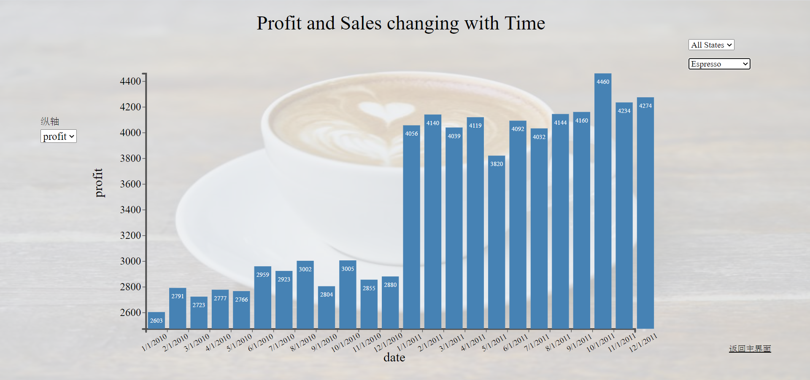

# 第四次作业

[TOC]

## 数据描述

使用python进行初步的数据分析发现，数据的属性如下：

- date：日期，从2010年1月1日到2011年12月1日，每个月只取1号，两年共24个月
- sales：卖出的数量
- profit：利润
- region：地区，共东西南中四个
- state：州，共20个
- category：品种，四个，分别为咖啡、凉茶、茶、浓咖啡
- type：品牌，是品种的细分，每个品种约有三到四个品牌
- caffeination：是否有咖啡因，两个值

## 可视化网页交互方法

使用d3.js并结合html网页共同进行可视化，从命令行进入src文件夹，输入anywhere回车即可运行网页。

### 首页

可以选择进入时间柱状图或饼图查看可视化结果

### 时间柱状图

柱状图横轴固定为时间，纵轴可选sales或profit，每个柱上标明了数据。右上角有两个选择框，分别可以选择20个州以及四个品种，也可以全部选择。以选择NY州的Coffee为例，如下图。

鼠标悬停在某个柱上，会显示该柱的时间、销量和利润，如下图

点击右下角的“返回主界面”回到首页。

### 饼图

一共八个饼图，两行四列，每一列代表一个region，第一行表示该region所含的州的销量或利润，第二行表示该region的四个饮品品种的销量或利润。最下面的total是该region的总销量或利润。在页面右上角，用户可以自行选择展示销量还是利润。

鼠标悬停在第一行的饼图的任意一个区域，可以显示该区域代表的州的四种饮品品种的销量或利润，展示的数字为当前选定的属性。

鼠标悬停在第二行的饼图的任意一个区域，可以显示在该region下，这种品种的饮品的不同品牌的销量或利润，展示的数字为当前选定的属性。

点击右下角返回主界面返回首页。

## 可视化结果的一些发现

1. 所有的品种的饮品在2010年1-3月、10-12月、2011年5月这三个时间点的销量明显小于其他时候的销量

2. 无论饮品、无论地区，几乎所有组合的2011年的利润都大于2010年的利润，如下图

   

3. 美国中部、东部、西部对该公司的四种饮品的喜好程度差不多，但该公司在美国南部的茶销量为0，可能是没有在南部上架茶。

4. 在该公司的利润占比中，美国东部的纽约州为东部贡献了一半多的利润，美国南部的德克萨斯州为南部贡献了将近一半的利润，美国西部的加利福尼亚州为西部贡献了几乎1/3的利润。

5. 该公司在美国西部的销量和利润都高于其他三个地区的值，南部的销量和利润为最低。

